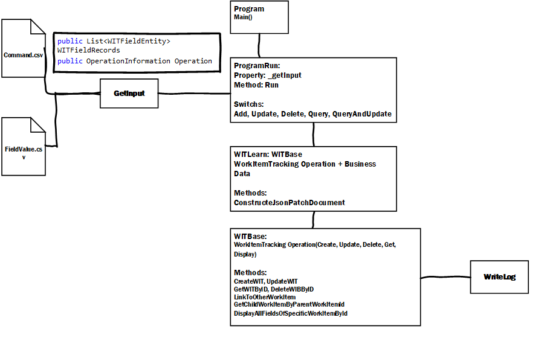

# ADO Tool Guide
### Summary
**ADO Tool** is an utility tool to quickly create the Learn work items, including Learning Path, Module, Unit.

In addition, it's a configurable tool to quickly operate Azure DevOps for any projects, on any kind of work item types. 
- the project settings are configured in file *App.config*.
- the operate/action commands are configured in file *Command.csv*.
- the field values are configured in file *FieldValue.csv*.

In summary, you could do following work with this tool:

- **Add** a single Work Item, or add a work item with it's child work items, it supports three level deep.
- **Delete** a specific work item, or delete a specific work item, as well as all it's child work items.
- **Update** a specific work item, or update a specific work item, as well as all it's child work items.
- **Get** a specific work item, display all the fields and values of a specific work item by work item id.
- **Query** work items by provided field/value pairs.
- **Query&Update** to query work items by provided field/value pairs, then update the work items using the field values configured in file *FieldValue.csv*. 

### Before run
You have to update the configurations in the *App.config* file, here are the settings that are required:
- **AzureDevOpsURI**, the Azure DevOps project collection url in this format https://[project].visualstudio.com
- **PATs**, the Personal Access Tokens , open your project collection, click on your user photo, select Security -> New Token, to generate a new token.
- **TeamProject**, the project name.
- **WITypeLevel1**, the level 1 work item type, for example 'Epics'. Used when creating/adding work items.
- **WITypeLevel2**, the level 2 work item type, for example 'Issues'. Used when creating/adding work items.
- **WITypeLevel3**, the level 3 work item type, for example 'Tasks'. Used when creating/adding work items.
- **LearningPathFile**, the *Command.csv* file name.
- **MetadataFile**, the *FieldValue.csv* file name.

### Command.csv
This tool will read the operator and it's parameter information from an input CSV file.

For *Add*, the input content format is:  
> [Operator],[Level 1 Work Item **Display Name**],[Level 2 Work Item **Count**],[Level 3 Work Item **Count** for first level2], [Level 3 Work Item Count for second level2],[...]

- [Required] The first column is for Add operator, the value could be: a, add, or Add.  
- [Required] The second column is **Level 1 work Item display name**, for example *Learning Path display name*, you need to make sure there is no comma (,) inside the display name.  
- [Optional] The third column is for **Level 2 work Item count**, for example *how many modules in this learning path*, it's a digital number.
- [Optional] For the rest columns, how many rest columns are vary, it depends on the value in the third column, it's in **[module].[Unit]** format.

Example:
```csv
a, Automation Test, 2, 1.2, 2.3
a, Automation Test, 2
a, Automation Test
```
For *Delete*, the input content format is:
> [Operator],[is Cascading delete (true/false)],[Work Item Id],[...]

- [Required] The first column is for Delete operator, the value could be: d, delete, or Delete.  
- [Required] The second column, if it's going to delete the work item and all it's child work items, set to **true**, otherwise, set to **false**
- [Required] The thrid column, the first work item id that is going to be deleted.

Example:
```csv
d,fasle,1246,1284
```
For *Update*, the input content format is:
> [Operator],[is Cascading delete (true/false)],[Work Item Id],[...]

- [Required] The first column is for Update operator, the value could be: u, update, or Update.  
- [Required] The second column, if it's going to update the work item and all it's child work items, set to **true**, otherwise, set to **false**
- [Required] The thrid column, the first work item id that is going to be update.

Example:
```csv
u,false,1285,1291
u,true,1347
```

For *Get*, the input content format is:
> [Operator],[work item id]

- [Required] The first column is for Get operator, the value could be: g, get, or Get,
- [Required] The second column is the specific work item Id

Example:
```csv
g,696
```

For *Query*, the input content format is:
> [Operator],[field:value],[field:value],[...]

- [Required] The first column is for Query operator, the value could be: q, query, or Query,
- [Required] The second columns are field/value pairs, at least one.

Example:
```csv
q,System.AreaPath: Courseware\LaaS SameDay,Custom.WhenToRun: Test Pass
```

For *Query&Update*, it's similar to *Query*.
Example:
```csv
qu,System.Id:374
```
### FieldValue.csv
When creating, updating the work items, the tool will read the fields and values information from an FieldValue CSV file.

- For this CSV file, the delimiter is '::'.
- For each line, there are four columns: Work Item Type, Field Name, Field Value.

Example:
```csv
Learning Path::Custom.summary::<div>A list item in learning path summary:<ol><li>a</li><li>b</li></ol></div>
Learning Path::Custom.md_ms_author::qijiexue
Learning Path::Custom.md_ms_author::v-qixue
Module::Custom.products::windows
Module::Custom.summary::<div>A list item in module summary:<ol><li>a</li><li>b</li></ol></div>
Unit::Custom.durationInMinitues::100
Unit::Custom.md_description::<div>A list item in unit description:<ol><li>a</li><li>b</li></ol></div>
Test Case::System.Description::<p>test case description</p>
```

### Tool Architecture
